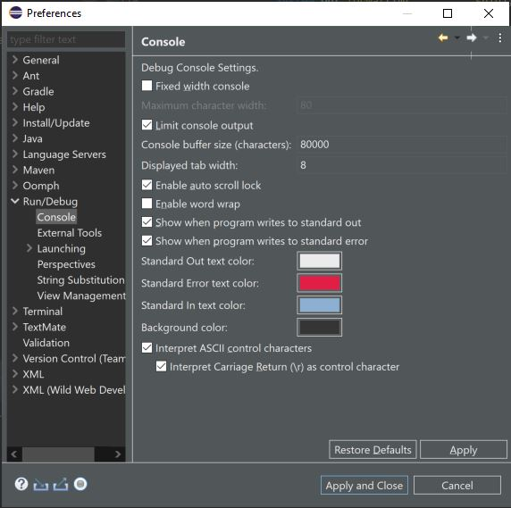
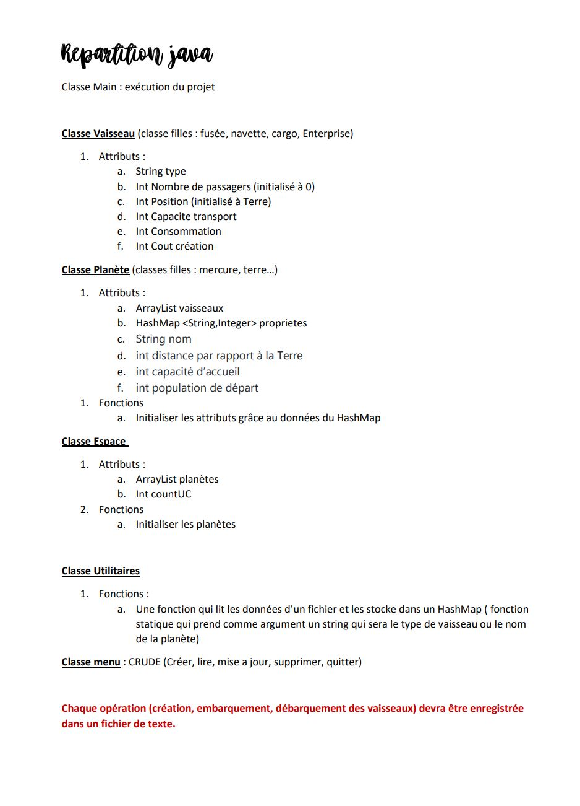

# Simulateur de vol spatial
## Sujet:

Simulateur de vol spatial, en mode console. L'objectif de l'application est de transporter tous les individus présent sur Terre vers d’autres planètes via des vaisseaux en un minimum de temps et de ressources. Nous nous baserons sur les planètes du système solaire.

## Prerequis
Pour que le programme se compile correctement il faut changer les parametres comme ceux-ci

## Methodologie

On a commencé par diviser le projet en plusieurs étapes

## Distrubition des tâches:
En se basant sur ce document on a pu se distribuer les tâches

Nesrine a commencé a créer la classe Vaisseau et ses classes filles (fusée, navette, cargo, Enterprise)  
Océane a créé les classe Planete,Espace et Utilitaires en reprenant les fonctions vus en classes  
Après on a travaillé ensemble sur la classe Menu
Nesrine n'a pas pu cloner le repo git donc elle envoyait tout via Discord.
